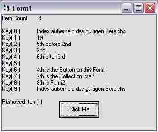



## Collection Item Keys

### Description

Unfortunately Collections do not expose the Keys of Items or the Index of Keys. So I made two little functions which return an Item's Key by Index -&gt; Key = ItemKey(Index, Collection) - and vice versa -&gt; Index = ItemIndex(Key, Collection). Download including samples on HowTo is only 2 kB.
 
### More Info
 

             |
---                |---
**Submitted On**   |2007-03-08 00:11:30
**By**             |[ULLI](https://github.com/Planet-Source-Code/PSCIndex/blob/master/ByAuthor/ulli.md)
**Level**          |Intermediate
**User Rating**    |5.0 (65 globes from 13 users)
**Compatibility**  |VB 6\.0
**Category**       |[Data Structures](https://github.com/Planet-Source-Code/PSCIndex/blob/master/ByCategory/data-structures__1-33.md)
**World**          |[Visual Basic](https://github.com/Planet-Source-Code/PSCIndex/blob/master/ByWorld/visual-basic.md)
**Archive File**   |[Collection205279392007\.zip](https://github.com/Planet-Source-Code/ulli-collection-item-keys__1-68075/archive/master.zip)

